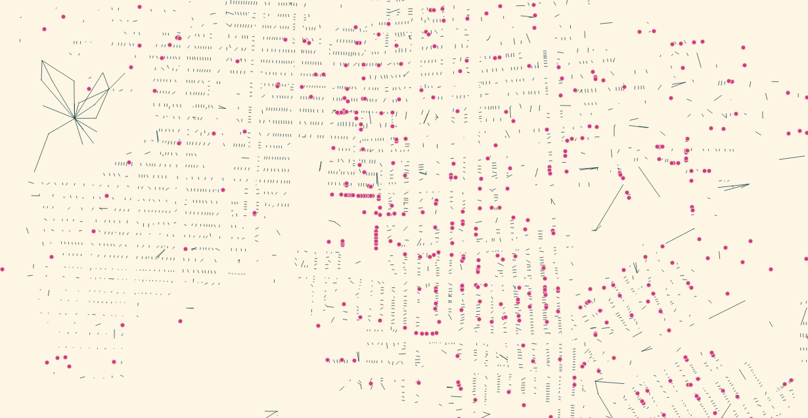
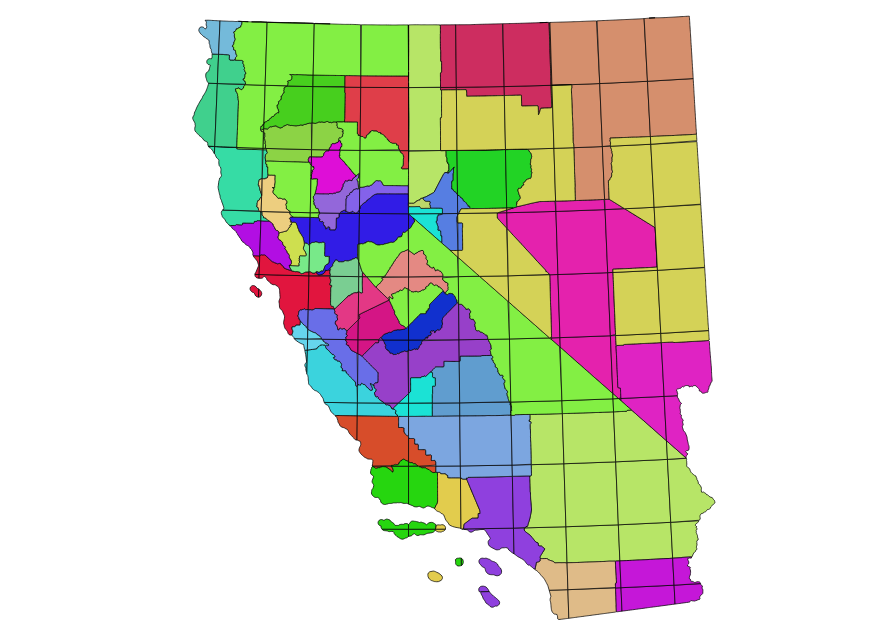

Dedupe
===

Code for deduplicating OpenAddresses data, currently U.S. English only.
Outputs GeoJSON with a mix of linestring features for matched groups of
addresses and point features for unmatched single addresses.

In this example image of [Butte, MT](http://www.openstreetmap.org/#map=15/46.0096/-112.5444)
dark-colored linestrings show addresses that have been matched between county
and statewide sources, while magenta dots show addresses that have not been
matched all. This shows that most normal addresses in Butte are correctly
deduped between county and statewide sources:

Sample Usage
---

Sample usage to install required packages, download 100,000 rows of sample data
from OpenAddresses, and generate a set of geojson files:

    $ pip3 install -r requirements.txt
    $ ./address-areas.py | head -n 100000 | ./address-map.py > 100k-filenames.txt
    $ for FILE in `cat 100k-filenames.txt`; do \
        sort -k 1,20 $FILE | ./expand-reduce.py > $FILE.geojson; \
        done

Addresses are deduped within the areas found in `geodata/areas.shp` matching
U.S. Census defined CBSA's and excluded state areas.

Sample Times
---

These samples were all run on a Virtualbox virtual machine:
Ubuntu 14.04, 1x CPU, 2GB memory, Python 3.4, and PostGIS.

All of [Santa Clara Valley](http://www.openstreetmap.org/#map=12/37.3358/-121.9244):

- 728,279 address rows.
- 52,629 comparison tiles sorted.
- 477,829 output features: 228,134 (65.5%) merged.

[Southwestern Montana](http://www.openstreetmap.org/#map=8/46.130/-112.360):

- 376,003 address rows in 0:35 minutes (57% cpu).
- 252,644 comparison tiles sorted in 1:15 minutes (19% cpu).
- 228,426 output features: 135,896 (63.9%) merged in 1:32 minutes (56% cpu).

All of [Montana](http://www.openstreetmap.org/#map=7/46.770/-110.121):

- 1,011,515 address rows in 1:37 min (59% cpu).
- 702,745 comparison tiles sorted in 3:29 min (20% cpu).
- 603,294 merged features: 335,835 (66.8%) merged in 36:23 min (21% cpu).

Merging took a long time when `expand-reduce.py` thrashed on low physical RAM.
Running this in parallel would solve the problem.
